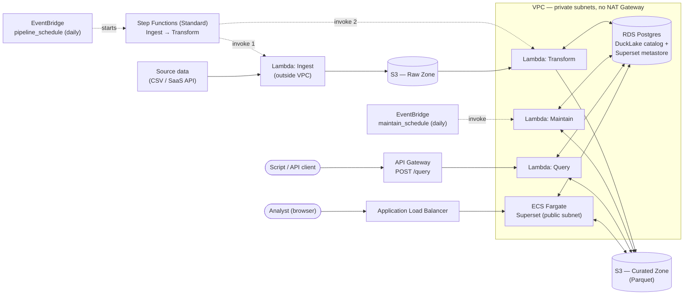

# Architecture Diagram

Reflects what's actually deployed (see `docs/architecture.md` for the full reasoning
behind each decision). Dashed arrows are orchestration/triggers; solid arrows are data
flow.

## Notes

- **Two separate consumption paths**: Superset (browser, for humans/dashboards) and API
  Gateway → Query Lambda (for scripts — `scripts/query_cli.py` uses this). Both read the
  same curated data.
- **Maintain is decoupled from the pipeline.** Step Functions only orchestrates
  Ingest → Transform; Maintain (compaction/snapshot expiry) runs on its own separate
  EventBridge schedule, invoked directly.
- **Ingest is the only Lambda outside the VPC** — it doesn't touch RDS, only S3 (and,
  eventually, external APIs), so it needs no VPC config and no NAT Gateway.
- **The Superset Fargate task sits in a public subnet**, not alongside the other 3
  Lambdas — ECS pulls container images over the task's own ENI (Lambda doesn't), so a
  private subnet there would need paid interface VPC endpoints instead.
- Not shown, to keep this readable: ECR (5 image repos — one per Lambda + Superset), the
  S3 gateway VPC endpoint, and IAM roles/security groups. See `docs/architecture.md` and
  the `terraform/modules/` for those.
